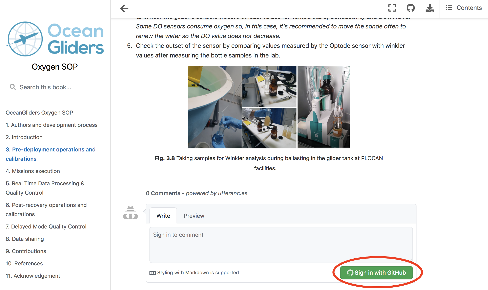
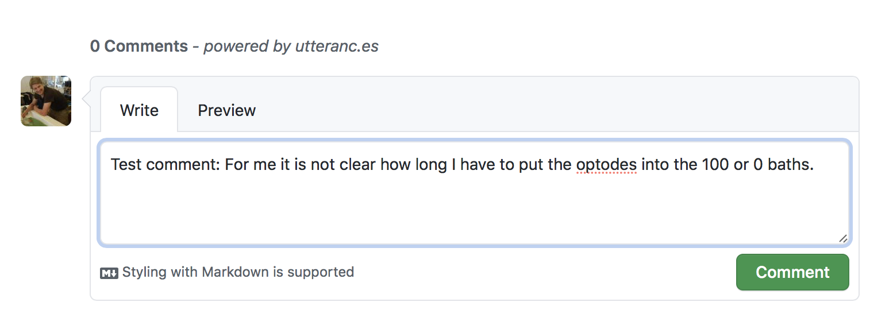
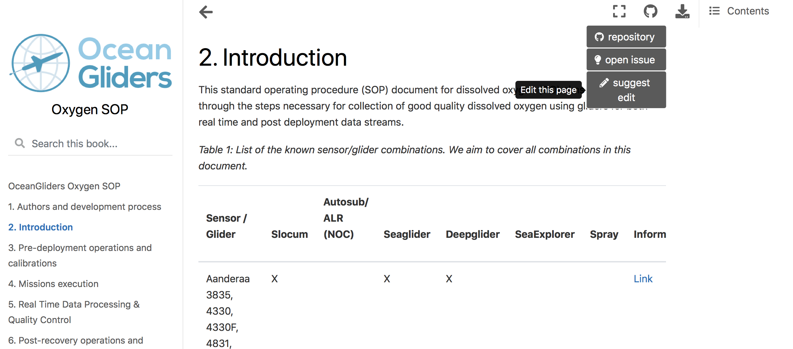

## How we make decisions on relevant content changes?

Every issue will be reviewed by at least one of the lead authors. 
They have the authority to decide whether the issues is a minor or major change. 
Minor changes can be accepted directly after one review of the lead authors. 
Major changes requires at least 3 reviews by co-authors with relevant knowledge on the specific topics. 
All major changes will remain open for at least 4 weeks to allow all co-authors to provide feedback. 
Every co-author can request a change to be reverted and request further discussion to reach a new consensus. 
Co-authors are encouraged to periodically review GitHub activity as co-authorship implies agreement with the content.  

### Minor change
- typos, language and formatting
- adding images

### Major change 
- adding new sensor descriptions
- change of uncertainties ranges
- concrete suggestions i.e. related to correction of methods

## How to contribute
Please read our [Code of Conduct](https://github.com/OceanGlidersCommunity/OceanGliders/blob/main/CODE_OF_CONDUCT.md) before contributing.

Important: We aim to have an organized discussion. Thus before adding new comments below sections, please always look at [open issues](https://github.com/OceanGlidersCommunity/DepthAverageCurrents_SOP/issues) and join the ongoing dicussion there.

You can contribute in two ways: [Case 1](https://github.com/OceanGlidersCommunity/DepthAverageCurrents_SOP/blob/main/CONTRIBUTING.md#case-1-comment-directly-on-the-online-document-without-knowing-github) - comment directly on the online document, [Case 2](https://github.com/OceanGlidersCommunity/DepthAverageCurrents_SOP/blob/main/CONTRIBUTING.md#case-2-make-a-concrete-suggestion-to-the-online-document-via-a-pull-request) - make a concrete suggestion to the online document via a pull request

### Case 1: Comment directly on the online document without knowing GitHub.

1. Read the Depth Average Currents SOP [here](https://oceangliderscommunity.github.io/DepthAverageCurrents_SOP/sections/DACs_introduction.html)

2) Scroll down to make your comment at the end of each section. 

3) Log into your GitHub account

4) Make your comment, describe the problem in a concise and organized way and only raise one major point per comment.

5) An issue is created automatically in the GitHub repository, which will be reviewed by the lead authors.

### Case 2: Make a concrete suggestion to the online document via a pull request

In general, we suggest to start a discussion (‘issue”) before directly editing the document via a “pull-request”. In particular if you request ‘major changes’. Editing the documents directly will require some basic [markdown](https://guides.github.com/features/mastering-markdown/) knowledge.

1. Read the Oxygen SOP [here](https://oceangliderscommunity.github.io/DepthAverageCurrents_SOP/sections/DACs_introduction.html)
2. Scroll up, move your mouse over the GitHub symbol and click "suggest edit".

4. The markdown file of the section is opened.
5. Edit the document using [markdown](https://guides.github.com/features/mastering-markdown/).
6. Make a [pull request](https://docs.github.com/en/github/collaborating-with-pull-requests/proposing-changes-to-your-work-with-pull-requests/creating-a-pull-request), tell us briefly why you made changes, and submit.
7. The SOP team will review your changes as outline above, and if approved, the process is complete and you're done.
8. All contributers will be listed as co-authors on the next peer-reviewed publication.

We are happy to provide individual training sessions for people who are new on GitHub. Please indicate your interest [here](https://github.com/OceanGlidersCommunity/DepthAverageCurrents_SOP/discussions/133) so we can organize sessions.
