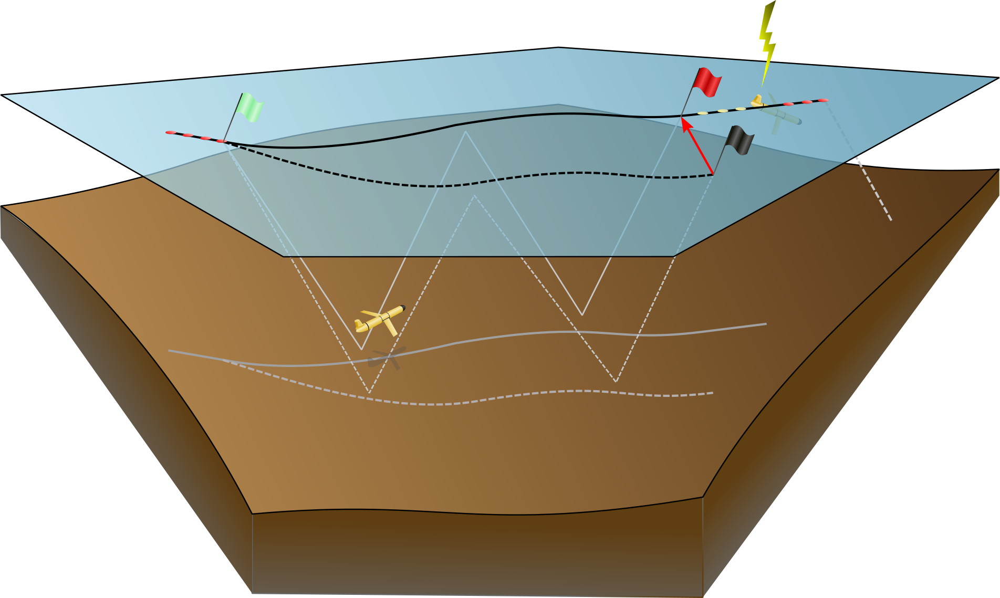

# Required Metadata, Real Time Data Processing & Quality Control

## Real Time Data Processing

### Seaglider
Seagliders (and Deepgliders) estimate a Depth Average Current (DAC) as the difference between GPS-tracked over ground and dead-reckoned displacement. 
This estimate relies on an accurate determination of through-water displacement, principally estimated using compass heading, vehicle pitch, variable buoyancy engine position, and vertical velocity measurements along with the Seaglider flight model. 
To briefly summarize Eriksen et al. 2001, Frakja-Williams et al. 2011, Bennett et al. 2019, and Bennett et al. 2021, this flight model employs multivariate regressions to determine vehicle-specific flight parameters including lift and drag coefficients as well as vehicle reference volume during steady flight (accelerations during variable buoyancy engine operations and turns are excluded by the regressions).
Assuming steady flight, a balance between lift, drag, and buoyancy forces, this regression seeks to minimize the difference between measured and estimated glider vertical velocity while determining the vehicle’s angle of attack. 
Given the obtained flight parameters, the momentum-balance equations of the buoyancy-pitch flight model then can be used to estimate vehicle speed and displacement both during steady flight and accelerations at the beginning and apogee of the profile.

This model is used both during and after missions to obtain optimal flight parameters and/or reprocess dive-climb cycles as needed, recognizing that certain parameters may change as a mission progresses. 
After a dive-climb cycle is completed, the DAC estimate is tagged at the midpoint location and time between surfacings, generally dive apogee where the vehicle reaches a maximum dive depth. 
Recent independent measurements of glider velocities via onboard velocimeter (Bennett et al. 2019) and acoustic tracking range (Bennett et al. 2021) have aided in the development of an improved automated flight model system capable of recommending updated flight parameters in near-real time as a mission progresses. 
Independent of these adjustments, however, results confirm the cross-track component of the DAC, used to estimate depth-dependent geostrophic flows, to be accurate within 1 cm/s. 

The basestation processing code, including the automated flight model system (FMS), has been made available to the commercial manufacturer.

### Spray
The details of the DAC estimate for Spray gliders are given by {cite:t}`rudnick2018depth`. 
In brief, horizontal displacement through the water is estimated during each 8-second interval between measurements of pitch, heading, and pressure. 
Horizontal displacement dr is computed from the change in pressure, measured pitch, and an assumed angle of attack of 3°. 
Northward and eastward displacements are then computed using measured heading. 
These incremental displacements are summed over an entire dive with corrections for times when a glider is nearly stalled or otherwise not flying as expected (e.g., while backing off the surface, during the bottom turn, while drifting on the surface; see details in the appendix of Rudnick et al. 2018). 

### Seaexplorer
Since 2020, the dead-reckoning of the SeaExplorer is an embedded algorithm. 
The dead-reckoned position of the SeaExplorer glider is estimated each 20s (10s during rollover periods) using compass heading and pitch, and depth measurements. 
Vertical velocity is computed from time and depth variations, while a steady flight model estimates the angle of attack and the horizontal speed of the glider from pitch and vertical velocity. 
The steady flight model is embedded in the glider in the form of a table giving the relations between pitch and Vx/Vz ratio. 
Displacement of the glider in ENU parameters is computed using measured heading (a spatially variable magnetic declination is stored onboard the glider) and the haversine formula. 
Dead-reckoned positions are stored in the navigation file, which can be downloaded by IRIDIUM, together with GPS positions. 
A Boolean value indicates clearly whether the position is dead-reckoned or real GPS fixes. 
SeaExplorer flight model has been evaluated using ADCPs measurements in the nearest sampling cell (ALSEAMAR technical note) and following the methodology of (Todd et al., 2017). 
Additional experiments have been conducted using an underwater GIB-FT GPS tracking system. 
Results have shown that most of the time the difference between ADCP estimates and flight model outputs are below 0.1 m/s with a median absolute difference of about 0.03 m/s (Homrani et al., in prep).

After a dive cycle is completed, the DAC can be computed as the difference between GPS-tracked over ground (only GPS fixes with a quality flag equal to “A” are considered) and dead-reckoned displacement. 
At the current stage, a NMEA sentence is sent by the glider when it surfaces. 
The sentence provides the DAC estimated during the previous cycle (DAC water current speed (m/s) and direction (°)). 
DAC accuracy has been assessed by comparison with platform independent measurements, i.e. moored ADCP, ship-ADCP and glider-ADCP. 
The median absolute difference was estimated to be 0.025 m/s  (ALSEAMAR technical note and Homrani et al., in prep.)

### Slocum
The Slocum glider relies on a simple flight model for its navigation
underwater. The flight model relates the horizontal velocity ($U$)
through water to the depth rate ($v$) and the pitch ($\theta$), both
of which are measured, as follows

`
\begin{equation} 
U = \frac{v}{\tan(\theta + \alpha)},  (x2)
\end{equation}
`

where $\alpha$ is the angle of attack. The Slocum glider firmware
implements the angle of attack as a constant value, multiplied by the
sign of the pitch. The value that the angle of attack assumes, is set by the
user-variable `u_angle_of_attack` in radians, which defaults to 0. 

For navigational purposes, the horizontal velocity is decomposed in
eastward and northward components using the measured heading,
corrected for the magnetic variation. The absolute horizontal velocity
component estimates are computed from the horizontal velocity through
water, augmented by the depth-averaged water currents estimated for
the previous dive segment. Distances travelled, expressed in metres
east and north, are computed by incremental integration of the
absolute velocities at the end of each system cycle (~ 4 s). The
Universal Transverse Mercator projection is used to map coordinates in
metres east and north to longitude and latitude coordinates.

:::{figure-md} DAC_slocum

Scematic on depth average currents (DACs) estimation for a Slocum glider.
:::

The algorithm to estimate the depth-averaged currents essentially
assumes that any difference in the point of surfacing between observed
from GPS and computed by dead-reckoning, is due to a depth-averaged
current not accounted for. Starting point of the algorithm is the last
of a series of GPS positions taken just prior to diving, indicated in
{numref}`DAC_slocum`) by the green flag, which is preceded by a number of GPS
position (red dots). Whilst under water, the algorithm computes
distances travelled north and east as explained above, indicated by
the dashed path. This differs from the real path flown (solid lines)
due to currents unaccounted for. The difference vector (red arrow)
between the computed surface location (black flag) and the actual
surface location (red flag), divided by the subsurface time yields the
depth-averaged current.

The actual surface location is not known, however, as it takes some
time (about 30-120 seconds) before a valid GPS position is obtained. A
surface drift velocity is computed from the sequence of GPS positions
(indicated by the yellow dots). The actual surfacing location is then
computed from extrapolation back in time and the glider sensor values
`m_water_v{xy}` are published, representing the east and northward
depth-averaged velocities, respectively. 

Due to the dual use of the antenna, no GPS positions are obtained
during communication via satellite. The drift velocity estimate is
refined with subsequent GPS positions obtained after the satellite
communications are dropped (second series of red dots), improving the
estimate of the actual surface location and the glider sensor values
`m_final_water_v{xy}` are published. The last GPS position serves as
starting point for the next dive.

At this point, it becomes also evident that the timestamp that is
attributed to the values of `m_final_water_v{xy}` is incorrect; rather
than the timestamp of one of the last GPS positions, the appropriate
time would be the average time of the dive and surface positions
(indicated by the green and red flags). This time lag can easily be
corrected for in post-processing. 

Finally, it is noted that around so-called inflection points, where
the glider transitions from ascending to descending and vice versa,
the flight model (see {numref}`DAC_slocum`) becomes highly inaccurate as the pitch
approaches zero. To that end, the algorithm implements a condition
that when the absolute value of the pitch is larger than or equal to
11.3 degrees, the flight model is used to compute the horizontal
velocity components; for absolute pitches smaller than this, the
long-term averaged horizontal speed, differentiating between down and
up casts averages. If `u_coast_time` is set to a value larger than 0
(default setting is 7.5 s), then the algorithm uses a reduced value of
the long-term averaged horizontal speed, where the reduction factor is
equal to (1-*tc*/`u_coast_time`) for
*t*c<`u_coast_time`, and zero otherwise. Herein
*t*c is the time since the absolute pitch fell below
11.3 degrees.

## Required Metadata and Real Time Data Processing

Please read the metadata requirements relevant for the [OceanGliders Format](https://github.com/OceanGlidersCommunity/OG-format-user-manual) before deploying your glider.

- Set Angle of Attack parameters for slocum? 
